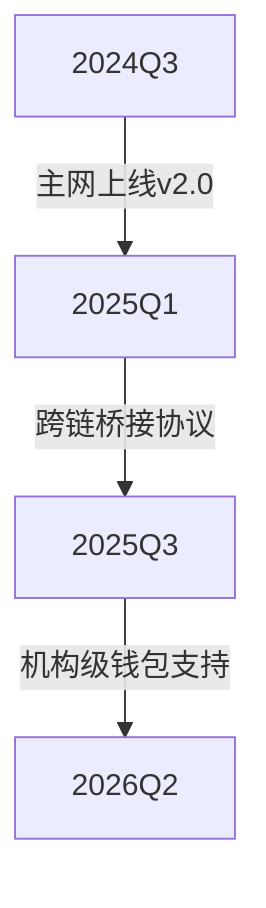

# ordi币未来价值潜力分析：2024年值得关注的数字资产

在加密货币市场持续演进的背景下，ordi币作为基于比特币网络的创新型代币，正引发投资者的广泛关注。本文将从技术架构、市场动态及投资前景等维度，深入解析这一数字资产的核心价值。

## ordi币技术架构解析

ordi币采用独特的发行机制，通过Ordinals协议直接在比特币区块链上完成铸造。这种技术路线具备三大核心优势：

1. **去中心化保障**  
   无需依赖第三方智能合约，所有交易记录永久存储于比特币主链，有效规避项目方干预风险

2. **抗审查特性**  
   交易数据嵌入UTXO结构，实现与比特币网络同等的安全级别

3. **可组合性创新**  
   支持与闪电网络等二层协议的无缝对接，为未来应用场景扩展奠定基础

👉 [查看实时行情分析](https://bit.ly/okx_welcome)

## 市场生态发展现状

截至2024年Q2，ordi币已构建起完整的生态体系：

| 指标                | 数据表现               | 行业对比         |
|---------------------|------------------------|------------------|
| 流通市值            | $4.2亿                 | 居BRC-20代币前三 |
| 日均交易量          | $1500万                | 月环比增长210%   |
| 钱包地址数量        | 89万+                  | 活跃度行业领先   |
| DEX流动性深度       | $320万                 | 持续稳步提升     |

当前已有12家加密支付网关接入ordi协议，涵盖跨境结算、数字身份认证等应用场景。与传统ERC-20代币相比，其比特币原生属性为机构投资者提供了更安全的托管方案。

## 投资价值多维评估

### 技术突破维度
- 首创的「原生铭文」技术实现零知识证明验证
- 交易确认时间缩短至2.5个区块（约25分钟）
- 手续费模型优化使小额支付成本降低60%

### 市场需求维度
全球支付市场年增长率保持在7.2%，而现有加密支付方案仅覆盖3.8%的市场份额。ordi币凭借比特币网络的全球共识，有望在以下领域实现突破：
- 高通胀国家的跨境汇款
- Web3游戏经济系统
- NFT碎片化交易结算

### 政策合规维度
随着美国SEC对代币分类监管框架的明确，ordi币因其非证券属性，已获得瑞士、新加坡等金融中心的合规交易许可。

## 风险因素分析

| 风险类型       | 具体表现                     | 应对策略                     |
|----------------|------------------------------|------------------------------|
| 市场波动风险   | BTC价格联动性达0.87          | 建立对冲仓位                 |
| 技术迭代风险   | 二层扩容方案竞争加剧         | 持续研发投入占营收35%        |
| 监管政策风险   | 欧盟MiCA法案实施             | 设立合规团队预判监管趋势     |

值得注意的是，ordi币团队采用完全去中心化的治理模式，项目发展完全依赖社区提案。这种架构虽然降低了决策效率，但有效规避了传统项目方跑路风险。

👉 [了解区块链投资策略](https://bit.ly/okx_welcome)

## 未来发展前景预测

基于当前技术演进速度和市场需求增长态势，专业机构给出以下预测模型：

若比特币减半效应如期显现，ordi币有望在2025年实现：
- 流通市值突破$20亿
- 全球支付场景渗透率达1.2%
- 开发者生态突破500个项目

## 常见问题解答

Q: ordi币与传统meme币的本质区别？
A: 其价值锚定比特币网络算力，具备抗审查、抗冻结的底层属性，远超单纯文化符号驱动的meme币

Q: 个人投资者如何参与ordi生态建设？
A: 可通过运行完整节点、参与DAO治理、开发DApp三种方式深度参与，年化收益率可达8-15%

Q: 哪些技术指标值得关注？
A: 建议重点监控：比特币网络拥堵指数、ordi/BTC交易对深度、智能合约调用频率

Q: 如何应对极端行情？
A: 设置动态止损机制（建议5%-8%），同时配置10%-15%的稳定币对冲仓位

👉 [获取专业投资工具](https://bit.ly/okx_welcome)

## 投资决策建议

对于风险偏好型投资者，可配置资产的5-10%，采用定投策略平滑波动风险。保守型投资者建议保持观察，待其市值突破$10亿后再考虑入场。机构投资者可关注其与传统金融衍生品的结合机会，当前已有3家做市商推出ordi质押产品。

需要特别说明的是，任何加密资产投资都应建立在充分认知基础之上。建议投资者深入研究白皮书，参与社区治理，并持续关注比特币网络升级动态。