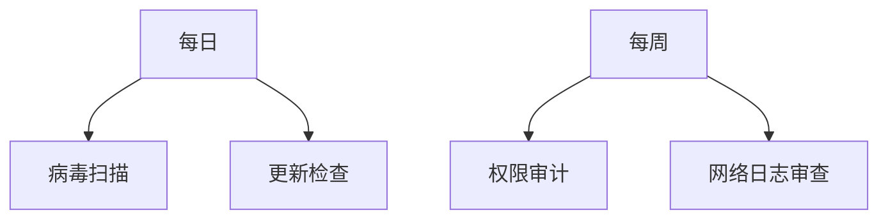

# 手机运行环境检测异常怎么解决？

## 一、安全提示的含义与影响

当您使用欧易OKX App时，系统可能弹出"安全提示"：检测到手机运行环境处于不安全状态。这类提示意味着当前操作环境存在信息泄露风险，可能导致数字资产被木马病毒、非法程序窃取或转移。

此前系统会通过闪退保障资产安全，现经技术优化后改为提示机制。用户需及时处理异常环境，防止资产损失。

👉 [立即检查手机安全状态](https://bit.ly/okx_welcome)

## 二、常见异常场景解析

以下六类环境异常最常触发安全检测：

| 异常类型       | 风险等级 | 常见原因                |
|----------------|----------|-------------------------|
| Root权限       | ⚠️高风险 | 系统权限开放              |
| 模拟器运行     | ⚠️高风险 | 非真实设备环境            |
| 调试模式       | ⚠️中风险 | 开发者调试遗留设置        |
| Hook框架       | ⚠️高风险 | 内存注入攻击风险          |
| 虚拟环境       | ⚠️中风险 | 多开分身工具              |
| 代理网络       | ⚠️中风险 | VPN/代理服务器连接        |

### 核心风险：Root权限的危害
Root权限相当于手机的"管理员权限"，虽然能深度清理系统垃圾、去除预装软件，但会带来三大致命风险：
1. 病毒可绕过系统防护机制
2. 系统稳定性下降导致意外崩溃
3. 隐私数据面临越权访问风险

## 三、针对性解决方案

### 1. Root状态处理方案
- **彻底清除Root权限**：使用专业工具如Magisk Manager移除Root标记
- **系统重置**：备份数据后恢复出厂设置
- **设备更换**：优先选择未Root的备用设备

### 2. 网络环境优化
- **公共WiFi防护**：切换至移动数据或可信私人网络
- **DNS优化**：改用1.1.1.1或8.8.8.8公共DNS
- **网络监控**：使用GlassWire检测异常连接

### 3. 软件环境清理
高危软件清单：
- 旧版浏览器（如Android 4.x内置浏览器）
- 非官方输入法（如某些第三方拼音输入法）
- 游戏修改器类工具

👉 [获取设备安全检测工具包](https://bit.ly/okx_welcome)

## 四、FAQ：高频问题解答

**Q1：非Root状态仍提示异常怎么办？**
A：建议检查是否使用了Magisk等隐藏Root工具，部分定制ROM可能存在系统级Root权限残留。

**Q2：连接公司网络会被检测异常吗？**
A：部分企业网络可能触发代理检测，可尝试关闭SSL解密功能或联系IT部门确认网络配置。

**Q3：双卡手机会影响检测结果吗？**
A：SIM卡数量不影响检测，但需注意副卡槽是否插入异常SIM卡（如测试卡、虚拟卡）。

## 五、预防性安全措施

建议建立三重防护体系：
1. **系统层**：保持Android系统更新至Android 12以上版本
2. **应用层**：安装专业安全软件（如Malwarebytes Mobile）
3. **行为层**：避免安装来历不明的APK文件

定期执行安全检查流程：

👉 [下载OKX安全防护指南](https://bit.ly/okx_welcome)

## 六、专业支持渠道

如遇复杂异常情况，可通过以下途径获取支持：
1. 欧易OKX App内"帮助中心"实时客服
2. 官方安全公告专栏（每月更新最新防护策略）
3. 数字资产安全培训课程（免费开放）

> 温馨提示：数字资产安全需要持续防护，建议每季度进行完整安全检测。选择硬件钱包作为冷存储方案可进一步提升资产安全性。