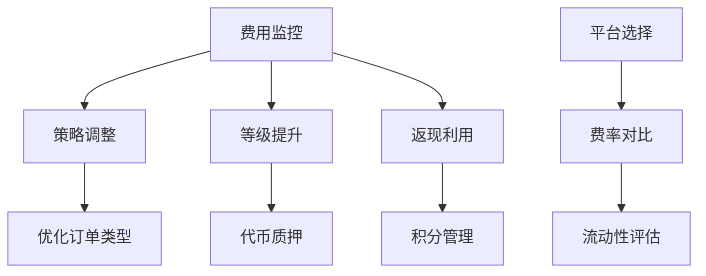

# 新手必读：全面解析加密货币交易所费用机制

## 加密货币交易所费用的构成要素

加密货币交易费用主要由两大部分组成：**合约交易手续费**和**资产存取费用**。其中合约交易手续费包含提供市场流动性的挂单费（Maker Fee）和即时成交的吃单费（Taker Fee）。以Gate.io为例，其手续费范围根据用户VIP等级呈现明显分层：挂单费0.055%-0.2%，吃单费0.065%-0.2%。

在资产存取方面，不同充值/提现方式费用差异显著：
- 银行转账：通常收取固定费用
- 信用卡支付：约2%-3%手续费
- C2C场外交易：多数平台免手续费

👉 [立即查看全球知名交易所费用详情](https://bit.ly/okx_welcome)

## 交易所费用结构的核心设计

主流平台普遍采用**阶梯式费率体系**，以0.1%-0.5%为基础交易费率。交易量越大，费率越低。例如：
| VIP等级 | 挂单费（%） | 吃单费（%） |
|---------|-------------|-------------|
| VIP 0   | 0.200       | 0.200       |
| VIP 7   | 0.075       | 0.085       |
| VIP 14  | 0.030       | 0.036       |

持有平台生态代币（如GT）可进一步降低费用，最高可达45%的折扣。这种分层设计既保障了高频交易者的成本优势，又通过激励机制促进平台生态发展。

### 常见问题解答
**Q：如何快速降低交易手续费？**  
A：可通过提升VIP等级、使用平台代币支付费用、选择挂单交易等方式实现。

**Q：不同交易所费用差异主要体现在哪些方面？**  
A：主要差异体现在费率分层机制、VIP升级标准、生态代币优惠政策等方面。

## 合约手续费计算模型解析

标准计算公式为：**合约手续费 = 持仓价值 × 对应费率（挂单/吃单）**

以实际案例说明：
- 用户A使用市价单交易价值100 USDT的BTC/USDT合约（VIP10等级）
- 吃单费 = 100 × 0.105% = 0.105 USDT
- 若用户B使用限价单提供流动性
- 挂单返现 = 100 × 0.095% = 0.095 USDT

值得注意的是，部分平台支持**手续费抵扣积分系统**，例如：
1. 挂单费0.025%需支付BTC
2. 剩余0.05%可用积分抵扣
3. 1积分=1美元手续费价值

## 交易成本优化策略

### 1. 交易策略优化
- **限价单优先**：享受挂单返现优惠
- **减少高频操作**：降低累计手续费支出
- **杠杆合理配置**：避免过度使用导致强制平仓

### 2. 费用返还机制
- **平台返现计划**：每日/每周手续费返还
- **邀请返佣机制**：通过专属链接邀请新用户
- **积分抵扣系统**：积累交易积分抵扣手续费

### 3. 账户等级提升
通过以下方式提升VIP等级：
- 提高30日累计交易量
- 增加持仓规模
- 持有平台代币

👉 [探索更多专业交易工具与费率优惠](https://bit.ly/okx_welcome)

### 常见问题解答
**Q：如何判断交易所的费用结构是否合理？**  
A：需综合比较费率分层、流动性深度、附加服务费用三个维度。

**Q：使用平台代币支付手续费有何优势？**  
A：除基础折扣外，部分平台还提供额外返现奖励。

## 风险控制与费用管理

在合约交易中需特别注意：
1. **强平风险**：维持保证金不足时触发自动平仓
2. **滑点成本**：市场深度不足导致成交价偏离预期
3. **资金费率波动**：影响持仓成本

选择平台时应重点考察：
- 风险控制系统的成熟度
- 流动性池规模
- 极端行情下的系统稳定性

### 专业建议
- 优先选择具有动态保证金调整机制的平台
- 关注深度行情数据（至少前五档报价）
- 测试平台在高波动时的报价连续性

## 智能费用管理体系构建

建立科学的交易成本管理框架：

### 常见问题解答
**Q：为何要特别关注市场深度对交易成本的影响？**  
A：市场深度不足会导致大额订单产生显著滑点，实际成交成本可能超过手续费本身。

**Q：如何平衡交易频率与成本控制？**  
A：建议通过回测系统测算最优交易周期，通常将单笔手续费控制在预期收益的15%以内。

## 行业标杆平台费用对比

选取三大主流平台进行费率分析：
| 平台名称 | 基础挂单费 | 基础吃单费 | VIP等级数 | 代币折扣率 |
|----------|------------|------------|-----------|------------|
| 平台A    | 0.06%      | 0.08%      | 12级      | 最高40%    |
| 平台B    | 0.04%      | 0.06%      | 9级       | 最高35%    |
| 平台C    | 0.05%      | 0.07%      | 15级      | 最高45%    |

注：以上数据为示例性质，实际数据请以平台最新公告为准。

👉 [获取实时交易所费用对比数据](https://bit.ly/okx_welcome)

### 新手操作指南
1. 初期以模拟交易熟悉费用结构
2. 从低手续费币种开始实盘交易
3. 每周统计手续费支出占比
4. 根据交易量动态调整VIP等级提升策略

通过系统化的费用管理，专业交易者可将综合交易成本降低40%-60%，显著提升长期收益表现。在选择交易平台时，建议建立包含费率、流动性、安全性、功能完备性的多维评估体系。