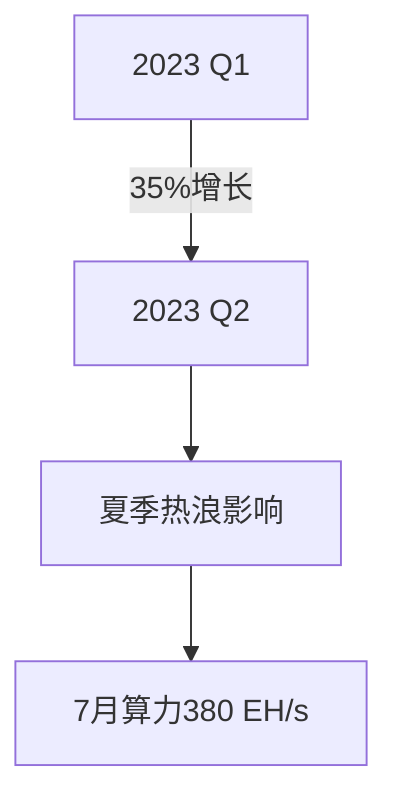

```markdown
# 比特币矿业深度报告：减半在即，矿工的生存与准备

## 行业格局演变：从东方到西方的算力迁徙

自全球挖矿政策变化后，比特币挖矿业经历结构性调整。北美地区算力占比攀升至45-50%，同时算力分布呈现全球化特征，俄罗斯、中东、东南亚等地正形成新算力中心。上市矿企与私营企业主导行业格局，通过资本运作与精细化管理构建竞争壁垒。

👉 [了解更多比特币挖矿解决方案](https://bit.ly/okx_welcome)

### 核心挑战与应对策略
- **成本控制**：电力成本占比超50%，需通过电价谈判、电力需求响应计划等降低支出
- **硬件迭代**：新一代矿机效率提升30%以上，但需平衡采购成本与减半周期
- **风险对冲**：运用期货工具锁定电力成本，建立6-12个月现金流储备

| 地区       | 算力占比 | 电力成本(美元/kWh) | 托管费率(美元/kWh) |
|------------|----------|---------------------|---------------------|
| 北美       | 48%      | 0.04-0.08           | 0.06-0.09           |
| 中东       | 15%      | 0.02-0.05           | 0.04-0.07           |
| 东南亚     | 12%      | 0.05-0.10           | 0.07-0.11           |
| 拉丁美洲   | 8%       | 0.03-0.06           | 0.05-0.08           |

### 算力价格波动特征
2023年第二季度算力价格呈现美元本位77美元/PH/天，较去年底增长30%。币本位价格0.00275 BTC/PH/天，受比特币价格波动影响显著。建议矿工建立动态成本模型，实时监控盈亏平衡点。

## 算力与挖矿难度动态

### 算力增长轨迹
截至2023年7月22日，比特币算力达380 EH/s，较年初增长50%。受夏季高温影响，北美算力增速放缓，但全球算力分布更趋均衡。



### 挖矿难度调整
当前挖矿难度达历史峰值53.91T，较年初增长52.5%。极端天气将引发阶段性难度下调，矿工需关注8月美国电网负荷情况。

## Ordinal铭文：交易费收入新引擎

### 技术革新带来的收益增长
BRC-20代币标准推动交易费用占比从1.63%（2022）跃升至8.11%（2023 Q3）。典型案例显示：
- 铭文交易单区块收益达12.5 BTC
- 矿工单日交易费收入突破$50万
- 区块大小突破4MB临界点

👉 [探索铭文技术应用](https://bit.ly/okx_welcome)

### 收益结构变化
| 收益类型     | 2022占比 | 2023 Q3占比 |
|--------------|----------|-------------|
| 区块补贴     | 98.37%   | 91.89%      |
| 交易费用     | 1.63%    | 8.11%       |

## 矿机市场发展趋势

### 价格波动与技术迭代
2023年Q3矿机价格呈现分化态势：
- 新一代机型（S19 XP/M50S++）溢价上升2-5%
- 上一代机型（S19 Pro/M30S）价格降幅达15-25%

| 型号           | 算力(TH/s) | 能效(J/TH) | 当前溢价 |
|----------------|------------|------------|----------|
| S19 XP         | 140        | 21.5       | +5.2%    |
| M50S++         | 150        | 22         | +4.7%    |
| S19j Pro+      | 104        | 24         | +2.1%    |

### 散热技术革新
液冷方案普及使能效提升40%：
- 水冷系统：单位算力能耗降低至15J/TH
- 浸没式冷却：设备密度提升3倍
- 混合冷却方案：维护成本降低30%

## 电力市场动态分析

### 北美电价趋势
美国工业电价呈现区域分化：
- 德州：0.04-0.07美元/kWh（含需求响应收益）
- 华盛顿州：0.06-0.09美元/kWh
- 纽约州：0.08-0.11美元/kWh

### 天然气价格传导
亨利枢纽现货价回落至2.56美元/MMBtu，较峰值下降73%。预测冬季价格将回升至2.80美元/MMBtu，建议矿工锁定6-12个月电力合同。

## 全球挖矿版图重构

### 新兴市场崛起
- **中东**：阿联酋核能+太阳能组合实现0.03美元/kWh电价
- **拉美**：巴拉圭水电成本0.02美元/kWh，Bitfarms签约150MW项目
- **俄罗斯**：托管费率0.055美元/kWh，政策监管框架逐步完善

### 监管动态
- 美国：17个州推出挖矿友好法案
- 加拿大：艾伯塔省开放自由电力市场
- 欧洲：芬兰核电成本降至0.04美元/kWh

## 上市矿企运营策略

### 财务健康度指标
| 指标         | 行业基准 | 优秀企业表现 |
|--------------|----------|--------------|
| 边际成本     | $15,000  | $10,000      |
| 算力增速     | 50%/年   | 80-120%/年   |
| 现金储备     | 3个月    | 6-12个月     |

### 资本运作模式
- 非稀释性融资：抵押矿机获取低息贷款
- 收益再投资：60-80%利润用于算力扩张
- 对冲策略：期货市场锁定20%算力收益

## 未来展望与投资建议

### 减半效应预测
- 算力重组：预计15-20%高成本矿机退出
- 行业集中度：前10大矿企占比将超60%
- 技术迭代：3nm芯片量产使能效突破15J/TH

👉 [获取减半应对策略](https://bit.ly/okx_welcome)

### 投资者策略
1. 关注北美、中东等低成本地区项目
2. 倾向采用液冷技术的矿场
3. 选择具备套期保值能力的企业
4. 配置部分收益型矿机（如二手S19系列）

## FAQ

**Q：比特币减半对矿工有何具体影响？**  
A：区块奖励将从6.25 BTC降至3.125 BTC，要求矿工将电力成本控制在$0.05/kWh以下才能保持盈利。

**Q：如何选择适合的矿机托管方案？**  
A：建议考虑三点：1）电力成本长期锁定能力 2）电网稳定性 3）需求响应收益机会。中东地区综合成本较北美低20-30%。

**Q：铭文技术会改变行业格局吗？**  
A：短期交易费收益提升显著，但需注意技术迭代风险。建议将铭文收益的30%用于对冲矿机折旧成本。

**Q：如何评估矿企的投资价值？**  
A：重点关注：1）算力增速（年化50%+）2）边际成本（<$15,000）3）现金储备（≥6个月运营成本）。

**Q：新兴市场投资需要注意哪些风险？**  
A：主要风险包括：1）电力政策稳定性 2）外汇管制 3）地缘政治影响。建议选择已上市企业或政府合作项目。
```